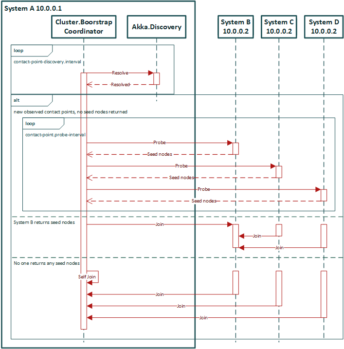

# Bootstrap Process

## Keywords
- __Discovery lookup__: The process of querying an external source for a set of __Contact Points__ that lives inside a 
  __neighbourhood__. The external source depends on the discovery method chosen.
- __Neighbours__: Machines/instances that lives inside the same `contact-point-discovery.service-name` and 
  `contact-point-discovery.service-namespace`. Each of these neighbours are considered as a __Contact Point__ 
  inside the neighbourhood. This has to be set ahead of time during configuration for the Akka Discovery to discover.
- __Contact point__: An internet address (IPv4 or IPv6) of a machine inside the neighborhood.
- __Contact point endpoint__: A HTTP endpoint, exposed via Akka Management by the Bootstrap Management extension 
  that is responsible for returning the `seed-nodes`, compiled from its internal cluster member status. Up to five 
  cluster members that are in the Up, WeaklyUp, or Joining state are returned as `seed-nodes`.
- __Probing__: The process of contacting the __Contact Point endpoint__ of a __Contact Point__ to query its cluster state,
  returning its `seed-nodes`
- __Stable discovery result__: A discovery result is considered as stable if there are no __discovery lookup__ result change observed 
  within `contact-point-discovery.stable-margin`. This is done to prevent join decisions being made based on fluctuating 
  __contact Points__.

## Lowest Address Join Decider Bootstrap Algorithm
- Each node performs discovery of its neighbours using Akka Discovery lookup every `contact-point-discovery.interval`.
- Every contact points resolved by discovery are then probed every `contact-point.probe-interval`.
- If any probing returns any `seed-nodes`, the bootstrap coordinator will perform a Cluster.JoinSeedNodes() and 
  stops the bootstraping process.
- If no `seed-nodes` are returned from any found contact points: 
  - Discovery and probing are continued until a contact point returns some `seed-nodes`,
  - or: 
    - If all of these conditions in sequence are met:
      1. At least `contact-point-discovery.required-contact-point-nr` nodes have been discovered,
      2. A stable discovery result have been achieved,
      3. `contact-point-discovery.contact-with-all-contact-points` is set to `true` and 
        communication with all discovered Contact Points have been confirmed via successful probing.
      4. `new-cluster-enabled` is set to `true`
    - If the current node have the lowest address sort order (__Node A__), the bootstrap coordinator will do a Cluster.Join() on Self.
  - On the next series of probing, __Node A__ will return itself as `seed-nodes`.
  - Other nodes in the neighborhood will see the cluster `seed-nodes` advertised by __Node A__ and joins the cluster.
  - The process completes after all nodes in the neighborhood joins the newly created cluster.

## Cluster Formation In a Dynamic Environment
It is important to realise no dynamic and automatic cluster joining solution provides 100% safety, 
however the process presented here is very close to it. Please note that even using a consistent data store for 
initializing seed-nodes is also not 100% safe, since race conditions could occur between nodes joining the cluster
via gossips and nodes joining the cluster via the strongly consistent store.

Akka bootstrap solution is prone to very few and rather rare races. Built-in protection against the race cases exists 
in the form of the stable timeout, which means that if any changes are being observed in discovery, the decision making 
is delayed until the observation is stable again. This prevents initiating joining while discovery is still inconsistent.

Note also that the bootstrap process does NOT rely on full consistency of the discovery mechanism when adding new nodes 
to an existing cluster. This is very desirable, since this situation usually occurs when a cluster is being dynamically 
scaled up due to increased load on your service, and some services may indeed not be fully consistent then. However, 
the Akka Cluster membership protocol IS strongly consistent, and it is the source of truth with regards what the cluster 
is consisted of, and no external system can have more reliable information about this (since it could be outdated). 
This is why the Contact Point probing mechanism exists, and even if discovery would only return partial or even different 
set of nodes for each lookup the probing would allow the node to still to join all the right nodes, thanks to how Akka Cluster 
membership and gossip protocols work. Summing up, the bootstrap mechanism works well for adding nodes to the system, 
even under load, even if the DNS system is not completely consistent.
