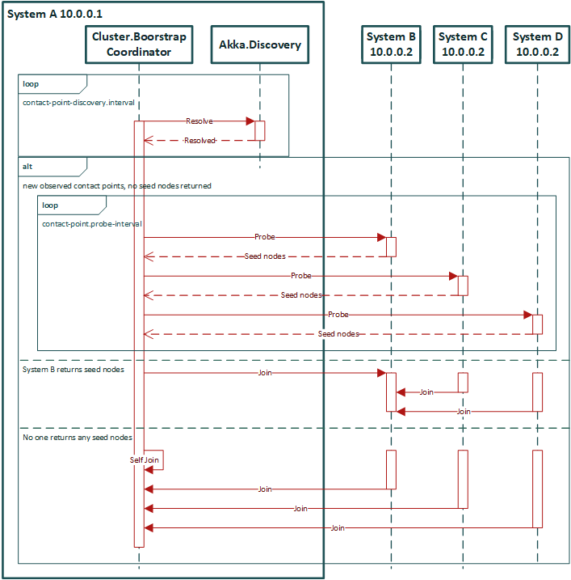

# Bootstrap Process
- Each node discovers its “neighbours” using Akka Discovery
  - Some initial negotiation between the nodes must take place to safely form a new cluster when there is no existing cluster.
- The node starts to probe the Contact Points of the discovered nodes (which are HTTP endpoints, exposed via Akka Management 
  by the Bootstrap Management Extension) for known seeds to join.
  - When a cluster exists the seed nodes are returned from probing the discovered Contact Points. It can immediately join such 
    seed nodes and the following steps for the initial bootstrap are not needed.
- When no cluster exists yet, none of the contacted nodes return any seed nodes during the probing process. 
  The following takes place to create a new cluster:
  - A service discovery lookup is done every contact-point-discovery.interval
  - If discovery returns the same Contact Points for the contact-point-discovery.stable-margin. 
    This is to prevent join decisions being made based on fluctuating Contact Points.
  - At least contact-point-discovery.required-contact-point-nr nodes have been discovered.
  - Communication with all discovered Contact Points have been confirmed via successful HTTP request-response.
  - Each node will discover that no cluster exists by probing each other and getting no seed-nodes, and a new one should be formed, 
    they know all their addresses, and decide that the “lowest” sorted address is to start forming the cluster.
  - The lowest address node (e.g. “A”) notices the same, and makes the decision to join itself.
  - Once the lowest addressed node has joined itself, it has formed a new cluster.
  - Other nodes notice that A has started returning itself as a seed-node in the Contact Point responses.
  - Any node, including X, immediately joins such seed node that it has observed in the Contact Point process.
  - Nodes continue probing the other nodes, and eventually will notice any of the existing nodes that are part of the cluster, 
    and immediately join it.
  - Eventually all nodes have joined the same cluster, the process is complete.

